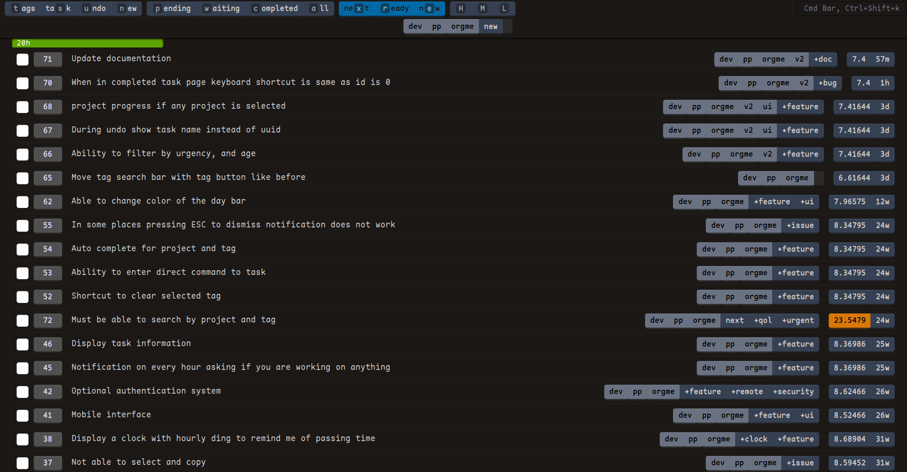
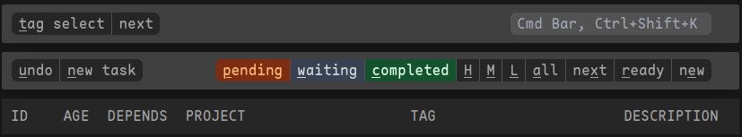
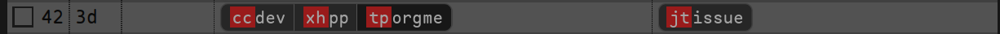
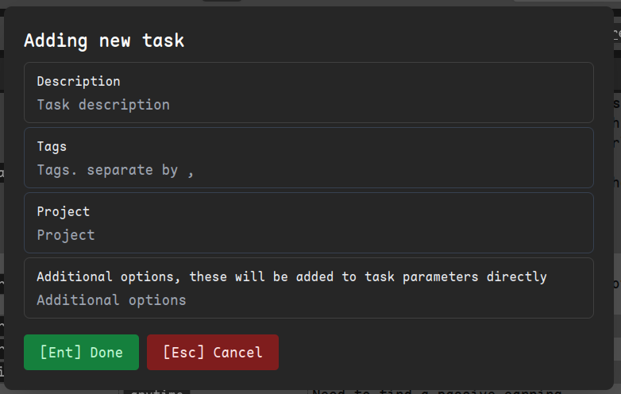
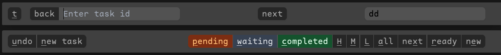
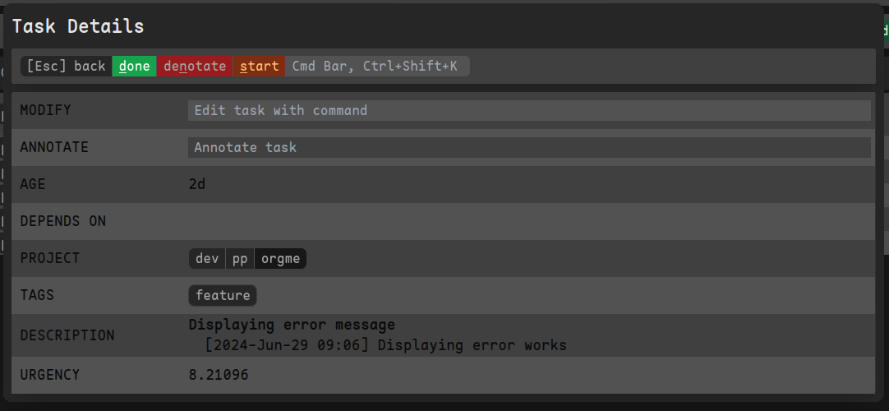
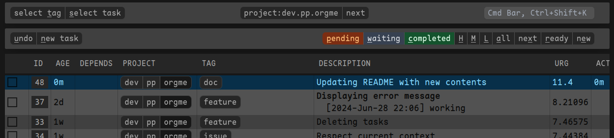
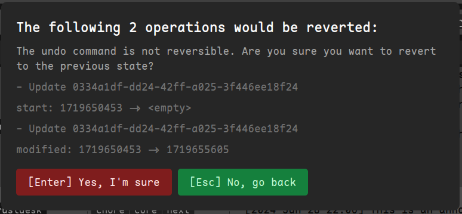
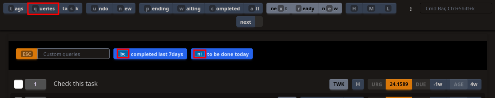
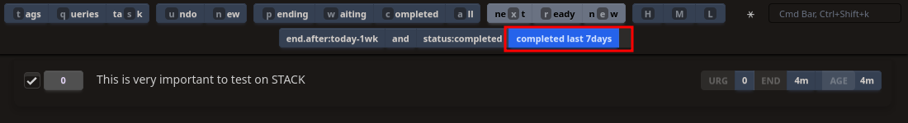

# NEW!

- Updated to tailwindcss 4 and using daisyui for UI components.
- Cleaned-up code a bit to make it easier to manage

Please report any bugs, contributions are welcome.

# What is this?

A Minimalistic Web UI for Task Warrior focusing on Keyboard navigation.

It's completely local. No intention to have any kind of online interactions.
Font in the screenshot is [Maple Mono NF](https://github.com/subframe7536/maple-font)

## Stack

- [Rust](https://www.rust-lang.org/) [nightly, will fail to build on stable]
- [axum](https://github.com/tokio-rs/axum)
- [tera](https://github.com/Keats/tera)
- [TailwindCSS](https://tailwindcss.com/)
- [daisyUI](https://daisyui.com/)
- [HTMX](https://htmx.org)
- [hotkeys](https://github.com/jaywcjlove/hotkeys-js)
- [rollup](https://rollupjs.org/)
- [Taskwarrior](https://taskwarrior.org/) (obviously :))
- [Timewarrior](https://timewarrior.net)

Still work in progress. But in the current stage it is pretty usable. You can see the list at the bottom, for what I intend to add, and what's been done.



# Using Release Binary

Latest release binaries are now available. Check the release tags on the sidebar

# Using Docker

Docker image is provided. A lot of thanks go to [DCsunset](https://github.com/DCsunset/taskwarrior-webui)
and [RustDesk](https://github.com/rustdesk/rustdesk/)

```shell
docker build -t taskwarrior-web-rs . \
&& docker run --init -d -p 3000:3000 \
-v ~/.task/:/app/taskdata/ \
-v ~/.taskrc:/app/.taskrc \
-v ~/.timewarrior/:/app/.timewarrior/ \
--name taskwarrior-web-rs taskwarrior-web-rs
```

As a service, every push to the `main` branch of this repository will provide automatic a docker image and can be pulled via

```shell
docker pull ghcr.io/tmahmood/taskwarrior-web:main
```

That should do it.

## Volumes

The docker shares following directories as volumes to store data:

| Volume path       | Purpose                                        |
| ----------------- | ---------------------------------------------- |
| /app/taskdata     | Stores task data (mostly taskchampion.sqlite3) |
| /app/.timewarrior | Stores timewarrior data                        |

It is recommend to specify the corresponding volume in order to persist the data.

## Ports

`taskwarrior-web` is by default internally listening on port `3000`:

| Port | Protocol | Purpose                          |
| ---- | -------- | -------------------------------- |
| 3000 | tcp      | Main webserver to serve the page |

## Environment variables

In order to configure the environment variables and contexts for `timewarrior-web`, docker environments can be specified:

| Docker environment               | Shell environment       | Purpose                                                  |
| -------------------------------- | ----------------------- | -------------------------------------------------------- |
| TASK_WEB_TWK_SERVER_PORT         | TWK_SERVER_PORT         | Specifies the server port (see "Ports")                  |
| TASK_WEB_DISPLAY_TIME_OF_THE_DAY | DISPLAY_TIME_OF_THE_DAY | Displays a time of the day widget in case of value `1`   |
| TASK_WEB_TWK_USE_FONT            | TWK_USE_FONT            | Font to be used. If not, browsers default fonts are used |
| TASK_WEB_TWK_THEME               | TWK_THEME               | Defines the theme to be used (see "Themes")              |

## Hooks

NOTE: If you have any hooks
(eg. Starting time tracking using time-warrior when we start a task,
you'll need to install the required application in in the docker, also the config files)

By default, the `timewarrior` on-modify hook is installed.

# Manual Installation

## Requirements

- rust nightly
- npm

### Installing rust nightly

Should be installable through `rustup`
https://rustup.rs/

### Building and Running

1. Clone the latest version from GitHub.
2. `cargo run --release`

That should be it! Now you have the server running at `localhost:3000` accessible by your browser.

### Troubleshooting

if you are receiving the following error in step 5

```shell

  thread 'main' panicked at build.rs:7:19:
  called `Result::unwrap()` on an `Err` value: Os { code: 2, kind: NotFound, message: "No such file or directory" }
  note: run with `RUST_BACKTRACE=1` environment variable to display a backtrace

```

It's because, `tailwindcss-cli` is missing

## Customizing

### Customizing the port

By default, the program will use 3000 as port,
you can customize through `.env` file or enviornment variable, check `env.example`

variable name: `TWK_SERVER_PORT`

### Displaying `time of the day` widget

By default the "time of the day" widget is not visible, to display it put

`DISPLAY_TIME_OF_THE_DAY=1`

in the `.env` file

### Font customization

Previously the app used `Departure Mono` as default font, which was also included in the repo.
It's now removed.
And the font can be set using env variable.

Add the following to change default font:

`TWK_USE_FONT='Maple Mono'`

### Themes

By default, `taskwarrior-web` provides two themes:

1. taskwarrior-dark (intended for dark mode)
2. taskwarrior-light (intended for light mode)

`taskwarrior-web` decides automatically based on the operating system and [browser preferences](https://developer.mozilla.org/en-US/docs/Web/CSS/@media/prefers-color-scheme) whether the light or the dark theme should be shown.

If a specific theme should be set fixed, the theme can be set as following in the environment:

`TWK_THEME=taskwarrior-dark` (for dark-mode)

# Using the app

You can use Mouse or Keyboard to navigate.



- All the keyboard mnemonics are underlined.
- The `Cmd Bar` needs to be focused (`Ctrl + Shift + K`) for the keyboard shortcuts to work

## Project and Tag selection

Keyboard shortcut is `t`

For selecting tag, once you enter tag selection mode, the `tag bar` is visible,
tag mnemonics are displayed on the tags, in red boxes, typing the mnemonics will immediately set the tag/project,

Note: selecting the tag/project again will remove the tag from filter.



## Creating new task

Keyboard shortcut is `n`

Which should bring up the new task dialog box. It will use the current tags and project to create the task


## Marking task as done or displaying task details

Call up task search: `s`
This should update top bar with the following, and also the task mnemonics are displayed with the id, in red boxes.
Typing the mnemonics will immediately mark the task as done,
or display the details of the task depending on mnemonics typed



In Task Details window, you can mark task as done[d] and start/stop [s] timer.
Also, denotate task using [n]
You can use task command to modify the task.
You only need to enter the modifications.



Once you start a timer it will be highlighted on the list


## Undo

Keyboard shortcut is `u`

This will bring up undo confirmation dialog


## Custom queries

Task organization is a pretty personal thing. And depending on the project or individual base, custom workflows and reportings are required.
Create a configuration file under Linux in `$HOME/.config/taskwarrior-web/config.toml` or under Windows in `%APPDATA%\taskwarrior-web\config.toml` and add custom queries.

A configuration file can look like:

```toml
[custom_queries]

[custom_queries.completed_last_week]
query = "end.after:today-1wk and status:completed"
description = "completed last 7days"

[custom_queries.due_today]
query = "due:today"
description = "to be done today"
fixed_key = "ni" # this will override randomly generated key
```

Following options for each query definition is available:
| property    | mandatory | meaning                                                                |
| ----------- | --------- | ---------------------------------------------------------------------- |
| query       |     X     | specifies the query to be executed on `taskwarrior`.                   |
| description |     X     | description to be shown in the Web-UI for recognizing the right query. |
| fixed_key   |           | Can be specified as two characters which will hardcode the shortcut.   |

The query can be selected via keyboard shortcuts or via click on the right buttons.
In order to select custom queries with the keyboard, first type in `q` as key for queries.
A list is shown with available custom queries:


On each custom query, either a pre-defined shortcut key is shown or an automatic and cached shortcut is shown.
The right one is typed and automatically the custom query is set:



As soon as one of the other reports like `next`, `pending` or others are selected, the custom query is unset and `taskwarrior-web` standard reports are shown.

Beside of a configuration file, it is possible to configure via environment variables as well:
```shell
env TWK_custom_queries__one_query__fixed_key=ni TWK_custom_queries__one_query__query="end.after:today-1wk and status:completed" TWK_custom_queries__one_query__description="completed last 7days" RUST_LOG="INFO" cargo run
```

The same way it is possible to configure the docker container accordingly.

## Switch theme

It is possible to switch the theme, which is saved in local storage too.

For this following three symbols are used (left of the command bar):

| Symbol | Purpose                              |
| ------ | ------------------------------------ |
| ⚹      | Auto Mode or forced mode from server |
| ☽      | Dark mode                            |
| 🌣      | Light mode                           |

# WIP warning

This is a work in progress application, many things will not work,
there will be errors, as no checks, and there may not be any error messages in case of error.

## Planned

- [ ] Better configuration
- [ ] Usability improvements on a long task list
  - [x] Hiding empty columns
  - [ ] Temporary highlight last modified row, if visible
- [x] Make the mnemonics same for tags on refresh
- [x] Modification
  - [x] Deleting
- [ ] Following Context
- [ ] Error handling
  - [x] Retaining input in case of error
  - [ ] Finetune error handling
- [ ] Add more tests
- [ ] Convert to desktop app using Tauri
- [ ] Reporting
  - [ ] Project wise progress
  - [ ] Burndown reports
- [ ] Column customization
- [ ] Color customization
- [ ] Time warrior integration, and time reporting
- [ ] Searching by tag name

## Issues

- [ ] Not able to select and copy tags, maybe add a copy button
- [ ] Keyboard shortcut applied when there is a shortcut key and I use a mnemonic
- [x] When marking task as done stop if active


