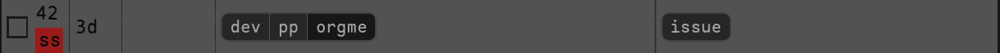

# Task Warrior Web UI focusing on Keyboard navigation

This is a straightforward, but mostly working task warrior web ui with strong focus on keyboard navigation.
It's completely local. No intention to have any kind of online interactions.

## Stack
* Rust
* axum
* tera
* TailwindCSS
* HTMX
* hotkeys
* rollup
* Task Warrior (obviously :) )

Still work in progress. But in the current stage it is pretty usable


# Requirements
* npm
* rollup
* tailwindcss-cli

## Installing tailwindcss-cli and rollup

download tailwindcss-cli:
on ArchLinux, it can be installed through any aur helpers
```shell
yay tailwindcss-bin
```

On other distros, you may have to download it.

```
curl -sLO https://github.com/tailwindlabs/tailwindcss/releases/latest/download/tailwindcss-linux-x64
```

Provided the `~/bin/` folder is in the $PATH variable, copy the executable file and make it executable

```shell
mv tailwindcss-linux-x64 ~/bin/tailwindcss
chmod +x ~/bin/tailwindcss
```

Install rollup
```
npm install rollup --global 
```

# Building and Running
1. Clone the latest version from GitHub.
2. `cd frontend`
3. `npm install`
4. `cd ..`
5. `cargo run --release`

That should be it! Now you have the server running at `localhost:3000` accessible by your browser.

## Troubleshooting

if you are receiving the following error in step 5

```shell

  thread 'main' panicked at build.rs:7:19:
  called `Result::unwrap()` on an `Err` value: Os { code: 2, kind: NotFound, message: "No such file or directory" }
  note: run with `RUST_BACKTRACE=1` environment variable to display a backtrace

```

It's because, `tailwindcss-cli` is 

## Customizing the port
By default, the program will use 3000 as port,
you can customize through `.env` file or enviornment variable, check `env.example`

variable name: `TWK_SERVER_PORT`

```shell
TWK_SERVER_PORT=9070 cargo run --release
```


# Using the app

You can use Mouse or Keyboard to navigate.


* All the keyboard mnemonics are underlined. 
* The `Cmd Bar` needs to be focused (`Ctrl + Shift + K`) for the keyboard shortcuts to work

## Project and Tag selection
Keyboard shortcut is `t`

For selecting tag, once you enter tag selection mode, the `tag bar` is visible,
tag mnemonics are displayed on the tags, in red boxes, typing the mnemonics will immediately set the tag/project


## Creating new task
Keyboard shortcut is `n`

Which should bring up the new task dialog box. It will use the current tags and project to create the task


## Marking task as done
Call up task search: `d`
This should update top bar with the following:


And also the task mnemonics are displayed with the id, in red boxes.
Typing the mnemonics will immediately mark the task as done




## Undo
Keyboard shortcut is `u`

This will bring up undo confirmation dialog


# WIP warning

This is a work in progress application, many things will not work,
there will be errors, as no checks, and there may not be any error messages in case of error. 

- [ ] Usability improvements on long task list
- [x] Marking a task done with keyboard shortcut
- [x] Bug fix, not unmarking completed task
- [ ] Editing/Deleting/Starting tasks
- [ ] Following Context
- [ ] Error handling
- [ ] Add more tests
- [x] Which port to run
- [ ] Convert to desktop app using Tauri
